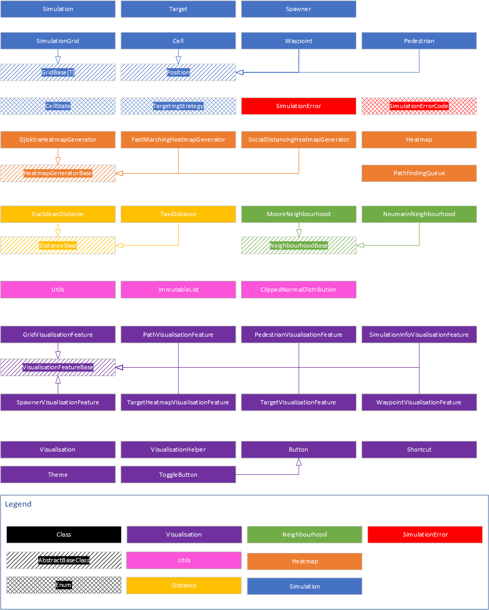

# Pedestrian simulation written in python

## Overview

The main file of this project is run.py the first passed argument is the path to a json [
`simulation configuration`](#section/configuration) file.

The visualisation will start automatically with the simulation. See the [`manual`](#section/visualisation) for a basic
overview of the visualisation.

<h2 id="section/configuration"> Configuration</h2>

The configuration is split into the following sections

| Field               | Type                                                        | Required | Default | Description                                                                                                                                 |
|---------------------|-------------------------------------------------------------|----------|---------|---------------------------------------------------------------------------------------------------------------------------------------------|
| `grid`              | [`Grid`](#configuration/grid-type)                          | Yes      | -       | Configuration of the simulation grid                                                                                                        |
| `neighbourhood`     | [`NeighbourhoodType`](#configuration/neighbourhood-type)    | Yes      | -       | Which algorithm to use to get neighbouring cells                                                                                            |
| `obstacles`         | [`Obstacle[]`](#configuration/obstacle-type)                | No       | null    | An array of obstacles                                                                                                                       |
| `spawners`          | [`Spawner[]`](#configuration/spawner-type)                  | Yes      | -       | An array of spawners                                                                                                                        |
| `targets`           | [`Target[]`](#configuration/target-type)                    | Yes      | -       | An array of target cells                                                                                                                    |
| `social_distancing` | [`SocialDistancing`](#configuration/social-distancing-type) | Yes      | -       | Configuration of social distancing rules                                                                                                    |
| `distancing`        | [`Distancing`](#configuration/distancing-type)              | Yes      | -       | Configuration of social distancing rules                                                                                                    |
| `simulation`        | [`Simulation`](#configuration/simulation-type)              | Yes      | -       | Configuration of the simulation                                                                                                             |
| `log_file`          | `string\|null`                                              | No       | null    | The path to a file to log the simulation data step-wise. `{0}` will be formated with the current date. If set to `null` logging is disabled |

Example Configuration:

```json
{
  "grid": {
    "width": 30,
    "height": 10,
    "neighbourhood": "MooreNeighbourhood"
  },
  "neighbourhood": "MooreNeighbourhood",
  "obstacles": [
    {
      "name": "obstacle1",
      "rect": [0, 0, 2, 2]
    }
  ],
  "spawners": [
    {
      "name": "S_left",
      "rect": [0, 0, 0, 9],
      "targets": ["T_right"],
      "total_spawns": 10,
      "batch_size": 1,
      "spawn_delay": 1,
      "initial_delay": 0,
      "targeting": "RANDOM"
    }
  ],
  "targets": [
    {
      "name": "T_right",
      "rect": [29, 0, 29, 9],
      "heatmap_generator": "DijkstraHeatmapGenerator",
      "cellstate": ["OBSTACLE"]
    }
  ],
  "social_distancing": {
    "width": 3,
    "height": 3
  },
  "distancing": {
    "type": "EuclideanDistance",
    "scale": 1.0
  },
  "simulation": {
    "time_resolution": 0.1,
    "occupation_bias_modifier": 1.0,
    "retargeting_threshold": 1.0,
    "waypoint_threshold": 1.0,
    "waypoint_distance": 5,
    "waypoint_heatmap_generator": "DijkstraHeatmapGenerator"
  }
}
```

### Configuration Types

<h4 id="configuration/simulation-type">Simulation Type</h4>

| Field                        | Type                                                            | Required | Default | Description                                                                                                                                                                                                               |
|------------------------------|-----------------------------------------------------------------|----------|---------|---------------------------------------------------------------------------------------------------------------------------------------------------------------------------------------------------------------------------|
| `time_resolution`            | `float`                                                         | Yes      | -       | The minimum amount of time between simulation steps in seconds                                                                                                                                                            |
| `occupation_bias_modifier`   | `float\|null`                                                   | No       | 1.0     | A factor which is multiplied with the occupation bias of a cell higher values mean the cell is less favourable as a next target. If set to `null` pedestrians cannot target cells which are `OCCUPIED`                    |
| `retargeting_threshold`      | `float\|null`                                                   | No       | -1.0    | The threshold in virtual moved meters at which a pedestrian will retarget to another cell which is not occupied                                                                                                           |
| `waypoint_threshold`         | `float\|null`                                                   | No       | -       | The threshold in virtual moved meters at which a pedestrian will retarget to a waypoint. Waypoints are a cheaper alternative to recalculating the target heatmap each simulation tick. Set to `null` to disable Waypoints |
| `waypoint_distance`          | `int`                                                           | No*      | -       | The depth for pathfinding to select a waypoint                                                                                                                                                                            |
| `waypoint_heatmap_generator` | [`HeatmapGeneratorType`](#configuration/heatmap-generator-type) | No*      | -       | The type of heatmap generator to use for pathfinding to a waypoint, cellstate will be set to `[OBSTACLE]`                                                                                                                 |

Example Simulation Configuration:

```json
{
  "time_resolution": 0.1,
  "occupation_bias_modifier": 1.0,
  "retargeting_threshold": 1.0,
  "waypoint_threshold": 1.0,
  "waypoint_distance": 5,
  "waypoint_heatmap_generator": "DijkstraHeatmapGenerator"
}
```

*Only if `waypoint_threshold` is set
<h4 id="configuration/grid-type">Grid Type</h4>

| Field           | Type                                                     | Required | Default | Description                                      |
|-----------------|----------------------------------------------------------|----------|---------|--------------------------------------------------|
| `width`         | `int`                                                    | Yes      | -       | The width of the simulation grid                 |
| `height`        | `int`                                                    | Yes      | -       | The height of the simulation grid                |
| `neighbourhood` | [`NeighbourhoodType`](#configuration/neighbourhood-type) | Yes      | -       | Which algorithm to use to get neighbouring cells |

<h4 id="configuration/target-type">Target Type</h4>

| Field               | Type                                                            | Required | Default      | Description                                                                                                                                                                                                                           |
|---------------------|-----------------------------------------------------------------|----------|--------------|---------------------------------------------------------------------------------------------------------------------------------------------------------------------------------------------------------------------------------------|
| `name`              | `string`                                                        | Yes      | -            | A unique name of the target                                                                                                                                                                                                           |
| `rect`              | `int[]`                                                         | No*      | -            | An array with exactly 4 entries `[x1, y1, x2, y2]` which spans an rectangle betwen `(x1, y1)` and `(x2, y2)`                                                                                                                          |
| `cells`             | [`Cell[]`](#configuration/cell-type)                            | No*      | -            | An array of cells that are part of the obstacle. Each cell is represented by a single integer.                                                                                                                                        |
| `cellstate`         | [`CellState[]`](#configuration/cell-state)                      | No       | `[OBSTACLE]` | A list of [`CellState`](#configuration/cell-state) which are considered blocked by the pathfinding algorithm. Pathfinding only gets updated each simulation step if any of the [`CellState`](#configuration/cell-state) is not static |
| `heatmap_generator` | [`HeatmapGeneratorType`](#configuration/heatmap-generator-type) | Yes      | -            | The type of heatmap generator to use for pathfinding for this target                                                                                                                                                                  |

*either `rect` or `cells` must be present

Example Target Configuration with `rect`:

```json
{
  "name": "T_right",
  "rect": [29, 0, 29, 9],
  "heatmap_generator": "DijkstraHeatmapGenerator",
  "cellstate": ["OBSTACLE"]
}
```

<h4 id="configuration/spawner-type">Spawner Type</h4>

| Field           | Type                                             | Required | Default  | Description                                                                                                  |
|-----------------|--------------------------------------------------|----------|----------|--------------------------------------------------------------------------------------------------------------|
| `name`          | `string`                                         | Yes      | -        | A unique name of the spawner                                                                                 |
| `rect`          | `int[]`                                          | No*      | -        | An array with exactly 4 entries `[x1, y1, x2, y2]` which spans an rectangle betwen `(x1, y1)` and `(x2, y2)` |
| `cells`         | [`Cell[]`](#configuration/cell-type)             | No*      | -        | An array of cells that are part of the obstacle. Each cell is represented by a single integer.               |
| `targets`       | `str[]`                                          | Yes      | -        | An array of target names that the pedestrians spawned by this spawner can walk to                            |
| `total_spawns`  | `int\|null`                                      | Yes      | -        | The total number of pedestrians to spawn. Use `null` for unlimited spawning                                  |
| `batch_size`    | `int`                                            | Yes      | -        | The maximum amount of pedestrians to spawn in each spawn attempt                                             |
| `spawn_delay`   | `float`                                          | Yes      | -        | The delay in seconds between each spawn attempt                                                              |
| `initial_delay` | `float`                                          | Yes      | -        | The delay in seconds before the first spawn attempt after the simulation started                             |
| `targeting`     | [`TargetingType`](#configuration/targeting-type) | No       | `RANDOM` | How to pick a target for a newly spawned pedestrian                                                          |

*either `rect` or `cells` must be present

Example Spawner Configuration with `rect`:

```json
{
  "name": "S_left",
  "rect": [0, 0, 0, 9],
  "targets": ["T_right"],
  "total_spawns": 10,
  "batch_size": 1,
  "spawn_delay": 1,
  "initial_delay": 0,
  "targeting": "RANDOM"
}
```

<h4 id="configuration/obstacle-type">Obstacle Type</h4>

| Field   | Type                                 | Required | Default | Description                                                                                                  |
|---------|--------------------------------------|----------|---------|--------------------------------------------------------------------------------------------------------------|
| `name`  | `string`                             | Yes      | -       | A unique name of the obstacle                                                                                |
| `rect`  | `int[]`                              | No*      | -       | An array with exactly 4 entries `[x1, y1, x2, y2]` which spans an rectangle betwen `(x1, y1)` and `(x2, y2)` |
| `cells` | [`Cell[]`](#configuration/cell-type) | No*      | -       | An array of cells that are part of the obstacle. Each cell is represented by a single integer.               |

*either `rect` or `cells` must be present

Example Obstacle Configuration with `rect`:

```json
{
  "name": "obstacle1",
  "rect": [0, 0, 2, 2]
}
```

Example Obstacle Configuration with `cells`:

```json
{
  "name": "obstacle1",
  "cells": [[0, 0], [1, 0], [2, 0], [0, 1], [2, 1], [0, 2], [1, 2], [2, 2]]
}
```

<h4 id="configuration/social-distancing-type">Social Distancing Type</h4>

| Field    | Type  | Required | Default | Description                              |
|----------|-------|----------|---------|------------------------------------------|
| `width`  | `int` | Yes      | -       | The width for social distancing formula  |
| `height` | `int` | Yes      | -       | The height for social distancing formula |

Example Social Distancing Configuration:

```json
{
  "width": 3,
  "height": 3
}
```

The social distancing formula is defined as follows:
$$
\begin{cases}
\text{repulsion} = height * \exp{\frac{1}{(\text{distance}/{width})^2 - 1}} & \text{if |distance|} < width \\
\text{repulsion} = 0 & \text{otherwise}
\end{cases}
$$

<h4 id="configuration/distancing-type">Distancing Type</h4>

| Field   | Type                                                         | Required | Default | Description                                  |
|---------|--------------------------------------------------------------|----------|---------|----------------------------------------------|
| `type`  | [`DistancingType`](#configuration/distancing-algorithm-type) | Yes      | -       | The type of social distancing to apply       |
| `scale` | `float`                                                      | Yes      | -       | The distance in meters of two adjacent cells |

Example Distancing Configuration:

```json
{
  "type": "EuclideanDistance",
  "scale": 1.0
}
```

<h4 id="configuration/cell-type">Cell Type</h4>
A cell is an `int[]` with exactly 2 entries `[x, y]` which represent the zero based x and y coordinates of the cell on
the grid. `[0, 0]` is the top left corner of the grid.

| Index | Type  | Required | Default | Description                    |
|-------|-------|----------|---------|--------------------------------|
| `[0]` | `int` | Yes      | -       | The `x` coordinate of the cell |
| `[1]` | `int` | Yes      | -       | The `y` coordinate of the cell |

### Algorithm Implementations

<h4 id="configuration/heatmap-generator-type">Heatmap Generator Type</h4>

| Name                           | Description                                              |
|--------------------------------|----------------------------------------------------------|
| `DijkstraHeatmapGenerator`     | Use Dijkstra's algorithm to generate the heatmap.        |
| `FastMarchingHeatmapGenerator` | Use the Fast Marching algorithm to generate the heatmap. |

<h4 id="configuration/neighbourhood-type">Neighbourhood Type</h4>

| Name                   | Description                                           |
|------------------------|-------------------------------------------------------|
| `NeumannNeighbourhood` | The four cells directly adjacent to the current cell  |
| `MooreNeighbourhood`   | The eight cells directly adjacent to the current cell |

<h4 id="configuration/distancing-algorithm-type">Distancing Algorithm Type</h4>

| Name                | Description                              |
|---------------------|------------------------------------------|
| `EuclideanDistance` | The Euclidean distance between two cells |
| `TaxiDistance`      | The Manhattan distance between two cells |

### Configuration Enums

<h4 id="configuration/cell-state">Cell State</h4>

| Name       | Is Static | Description                                     |
|------------|-----------|-------------------------------------------------|
| `FREE`     | Yes       | The cell is free to walk on.                    |
| `OBSTACLE` | Yes       | The cell is blocked by an obstacle.             |
| `OCCUPIED` | No        | The cell is currently occupied by a pedestrian. |     

<h4 id="configuration/targeting-type">TargetingStrategy Type</h4>

| Name       | Description                                                                                                            |
|------------|------------------------------------------------------------------------------------------------------------------------|
| `RANDOM`   | Pick a random target from the `targets` array                                                                          |
| `CLOSEST`  | Pick the target that is closest to the spawner. If multiple targets are equally close, pick the first one in the list  |
| `FURTHEST` | Pick the target that is furthest from the spawner. If multiple targets are equally far, pick the first one in the list |

<h2 id="section/visualisation"> Visualisation </h2>

The visualisation runs in realtime and consists of different toggable layers called [
`features`](#visualisation/features). Additionally to the buttons on the top of the window, the following keyboard
shortcuts are available as well:

<h3 id="visualisation/features">Visualisation Features</h3>

| Name            | Z-Index* | Description                                                                                                                                                                     |
|-----------------|----------|---------------------------------------------------------------------------------------------------------------------------------------------------------------------------------|
| `TargetHeatmap` | 0        | Renders the heatmap of the selected target and social distancing heatmap                                                                                                        |
| `Spawner`       | 1        | Renders the spawners and their spawn cells                                                                                                                                      |
| `Target`        | 2        | Renders the target cells and their target cells                                                                                                                                 |
| `Grid`          | 3        | Renders the base grid, obstacles and grid lines                                                                                                                                 |
| `Path`          | 4        | Renders the path of the selected pedestrian                                                                                                                                     | 
| `Waypoint`      | 5        | Renders all waypoints and a line connecting them to their associated pedestrian                                                                                                 |
| `Pedestrian`    | 6        | Renders all pedestrians, their headed direction, their target cell and information. Inner color is the same as its spawners color and outline has the same color as it's target |
| `Info`          | 7        | Renders the current simulation time, step count, current fps and the amount of pedestrians in the grid                                                                          |

*Order of the rendering, lower layers are rendered first meaning they can get covered by higher layers

<h3 id="visualisation/keyboard-shortcuts">Keyboard Shortcuts</h3>

| Combination   | Description                                                                                          |
|---------------|------------------------------------------------------------------------------------------------------|
| `h`           | Toggle the heatmap visualisation feature                                                             |
| `s`           | Toggle the spawner visualisation feature                                                             |
| `t`           | Toggle the target visualisation feature                                                              |
| `g`           | Toggle the grid visualisation feature                                                                |
| `p`           | Toggle the pedestrian visualisation feature                                                          |
| `i`           | Toggle the info visualisation feature                                                                |
| `d`           | Toggle social distancing rendering in heatmap visualisation feature                                  |
| `r`           | Toggle the path visualisation feature                                                                |
| `l`           | Toggle rendering of the grid lines in the grid visualisation feature                                 |
| `w`           | Toggle rendering of the waypoints visualisation feature                                              |
| `n`           | Toggle rendering of object names in all visualisation feature                                        |
| `p` + `SHIFT` | Toggle rendering of pedestrian detail text in pedestrian visualisation feature                       |
| `p` + `CTRL`  | Toggle rendering of line pointing to the pedestrians target cell in pedestrian visualisation feature |
| `w` + `SHIFT` | Toggle rendering of line between pedestrian and it's waypoint in pedestrian visualisation feature    |
| `Space`       | Toggle running of the simulation                                                                     |
| `Arrow Up`    | Select previous pedestrian path in pedestrian visualisation feature                                  |
| `Arrow Down`  | Select next pedestrian path in pedestrian visualisation feature                                      |
| `Arrow Left`  | Select previous target in heatmap visualisation feature                                              |
| `Arrow Right` | Select next target in heatmap visualisation feature                                                  |

<h3 id="visualisation/mouse-interaction">Mouse Interaction</h3>

| Action       | Target     | Description                                                                      |
|--------------|------------|----------------------------------------------------------------------------------|
| `Left Click` | Pedestrian | Select the pedestrian and show it's path in the pedestrian visualisation feature |
| `Left Click` | Target     | Select the target and show it's heatmap in the heatmap visualisation feature     |

## Architecture

The architecture is divided into different [`modules`](#architecture/modules), each module is responsible for a specific aspect of the
simulation.

<h3 id="architecture/modules">Modules</h3>

| Path                                           | Description                                                                                                                         |
|------------------------------------------------|-------------------------------------------------------------------------------------------------------------------------------------|
| [`exceptions`](#architecture/exceptions)       | Contains custom exceptions for the simulation                                                                                       |
| [`serialization`](#architecture/serialization) | Contains the interfaces and logic for serializing and deserializing the states of simulation objects for logging                    |
| `simulation/core`                              | Contains the core simulation logic, such as the simulation loop, pedestrian movement and pathfinding as well as the core components |
| `simulation/heatmaps`                          | Contains the heatmap generation logic, such as Dijkstra's algorithm and the Fast Marching algorithm                                 |
| `simulation/heatmaps/distancing`               | Contains different algorithms for distance calculation between two cells                                                            |
| `simulation/neighbourhood`                     | Contains different algorithms for getting neighbouring cells                                                                        |
| `simulation_config`                            | Contains the logic for parsing the simulation configuration from a json file                                                        |
| `visualisation`                                | Contains the logic for the visualisation of the simulation                                                                          |
| `visualisation/features`                       | Contains the different visualisation features and their logic                                                                       |
| `utils`                                        | Contains utility functions used throughout the simulation                                                                           |

<h4 id="architecture/overview">Overview over all classes and their inheritance</h4>



<h4 id="architecture/exceptions">Exceptions Module</h4>

This module contains `SimulationError` and an enum of applicable error codes.

| File                       | Description                                                  |
|----------------------------|--------------------------------------------------------------|
| `simulation_error.py`      | Contains the `SimulationError` class                         |
| `simulation_error_code.py` | Contains the `SimulationErrorCode` enum with all error codes |

The `SimulationError` class is a custom exception class that takes an error code and a dictionary as context. The error
message is derived from the error code and the context is used to enrich the error message with additional information.

<h4 id="architecture/serialization">Serialization Module</h4>

| File              | Description                                                                                       |
|-------------------|---------------------------------------------------------------------------------------------------|
| `serializer.py`   | Contains the logic for serializing and deserializing the states of simulation objects for logging |
| `serializable.py` | Contains the abstract base class for objects that can be serialized and deserialized              |

Serialization is done by inheriting the `Serializable` base class and implementing the `get_serialization_data` and
`get_identifier` methods. The `Serializer` class can then be used to serialize and deserialize the objects.
`get_serialization_data` should return a dictionary with string key and value which is either a `primitive`, an `array`
or a `Serializable` with the data that should be serialized and `get_identifier` should return a unique identifier for
the object.
This dictionary is then traversed recursively and all `Serializable` objects are replaced with the result of their
`get_serialization_data` method.

<h5 id="architecture/serialization/heatmap">Heatmap Serialization</h5>

Heatmaps are serialized as binary data and afterward encoded in base64 to save space in the log file.
The 2D heatmap is indexed as a 1D array, the index of the 1D array is calculated as `y * width + x`.

| Field  | Offset | Size                      | Type      | Endianess | Description               |
|--------|--------|---------------------------|-----------|-----------|---------------------------|
| width  | 0x00   | 0x04                      | uint32    | little    | The width of the heatmap  |
| height | 0x04   | 0x04                      | uint32    | little    | The height of the heatmap |
| data   | 0x08   | 0x08 * `width` * `height` | float64[] | little    | The heatmap data          |

<h4 id="architecture/simulation/core">Simulation Core Module</h4>

This module contains the core simulation logic, such as the simulation loop and core classes

| File                                                        | Description                                                                                                                                                                                                                                                                |
|-------------------------------------------------------------|----------------------------------------------------------------------------------------------------------------------------------------------------------------------------------------------------------------------------------------------------------------------------|
| `cell.py`                                                   | Contains the `Cell` class which represents a cell on the grid                                                                                                                                                                                                              |
| `cell_state.py`                                             | Contains the `CellState` enum which represents the state of a cell on the grid                                                                                                                                                                                             |
| `grid_base.py`                                              | Contains the `GridBase[T]` class which is an abstract base class for all 2D grids. It contains logic to index the internal 1D array and to check if something is in bounds                                                                                                 |
| [`pedestrian.py`](#architecture/simulation/core/pedestrian) | Contains the `Pedestrian` class which contains fields and logic to handle pedestrians                                                                                                                                                                                      |
| `position.py`                                               | Contains the abstract `Position` class which is inherited by anything which has a position on the simulation grid. Also offers methods to compare different implementations of `Position` only by `x` and `y` coordinate                                                   |
| `simulation.py`                                             | Contains the `Simulation` class which represents the complete simulation and core loop of the simulation                                                                                                                                                                   |
| `spawner.py`                                                | Contains the `Spawner` class which handles the logic for [`Pedestrian`](#architecture/simulation/core/pedestrian) creation                                                                                                                                                 |
| `target.py`                                                 | Contains the `Target` class which represents a target a [`Pedestrian`](#architecture/simulation/core/pedestrian) can walk to and exit the simulation. This class contains all cells which belong to the target and handles the generation of it's navigation heatmap       |
| `targeting_strategy`                                        | Contains the [`TargetingStrategy`](#configuration/targeting-type) enum                                                                                                                                                                                                     |
| `waypoint.py`                                               | Contains the `Waypoint` class which represents a waypoint a [`Pedestrian`](#architecture/simulation/core/pedestrian) can walk to and exit the simulation. This class contains the cell where the waypoint is located and handles the generation of it's navigation heatmap |

<h5 id="architecture/simulation/core/pedestrian">Pedestrian</h5>

The [`Pedestrian`](#architecture/simulation/core/pedestrian) class handles the tracking of a single pedestrians. Pedestrians have an `update` method which should be called every simulation tick. The `can_move` method checks if the pedestrian can move to it's current target cell including bookkeeping of the moved distance to handle different walking speeds. Once a pedestrian `can_move` returns `True` the `move` method to update the pedestrians state, the cell has to be updated by the simulation itself since the pedestrian only modifies it's own state. Bookkeeping of movement speed works by calculating the distance to it's target cell and storing it in `_current_distance`. Every update the `time_delta` is multiplied by the pedestrians `_current_speed` and subtracted from `_current_distance`. Once `_current_distance` reaches 0 the pedestrian can move upon it's target cell if the cell is free. `_current_distance` can become negative to signal for how long a pedestrian has been stuck. Pedestrians are updated in order of their `_current_distance` where the ones with the lowest value get updated first   

<h5 id="architecture/simulation/core/spawner">Spawner</h5>

The [`Spawner`](#architecture/simulation/core/spawner) class handles the spawning of pedestrians. The `update` method should be called every simulation tick. It yields a list of newly created pedestrians which have to be added to the simulation. It also chooses a target for the pedestrian and it's optimal walking speed by sampling from a [normal distribution](#architecture/utils/clipped_normal_distribution) with mean 1.34 m/s and standard deviation 0.26 m/s. It's value is taken absolutely (to prevent negative speeds) and clipped to a range between 0.69 and 2.45 as suggested by [Similar Normal Distribution of Pedestrian Speeds at Signalized Intersection Crosswalks](https://ieeexplore.ieee.org/document/6977742). Spawning happens in batches where the size is the minimum of `batch_size` and the count of free spawn cells.

<h5 id="architecture/simulation/core/target">Target</h5>

The [`Target`](#architecture/simulation/core/target) class handles the generation of the navigation heatmap for the target. The heatmap is generated by the selected [`HeatmapGenerator`](#configuration/heatmap-generator-type) and is updated either at the beginning of the simulation or every simulation tick if it also considers [`OCCUPIED`](#configuration/cell-state) as blocked. The heatmap is used by the pedestrians to find the shortest path to the target. The target also contains the cells and a method `is_inside_target` to check if a [`Position`](#architecture/simulation/core/position) is inside of one of the target's cells.

<h5 id="architecture/simulation/core/position">Position</h5>

The [`Position`](#architecture/simulation/core/position) class is an abstract base class which is inherited by anything which has a position on the simulation grid. It contains the `x` and `y` coordinates and a `pos_equals` method to compare different implementations of `Position` only by `x` and `y` coordinate.

<h5 id="architecture/simulation/core/waypoint">Waypoint</h5>

The [`Waypoint`](#architecture/simulation/core/waypoint) class handles the generation of the navigation heatmap for the waypoint. The heatmap is generated by the selected [`HeatmapGenerator`](#configuration/heatmap-generator-type) and is updated either at the beginning of the simulation or every simulation tick if it also considers [`OCCUPIED`](#configuration/cell-state) as blocked. The waypoint is used by the pedestrians to find the shortest path to the waypoint. The waypoint also contains the cell and a method `is_inside_waypoint` to check if a [`Position`](#architecture/simulation/core/position) is inside of the waypoint's cell. A waypoint is only created when the simulations `waypoint_threshold` is set and the pedestrian couldn't move for longer than the threshold. A [`Waypoint`](#architecture/simulation/core/waypoint) is a cheaper alternative to updating the navigation heatmaps of each target each ticks in respect of all pedestrians. It works by generating a Heatmap with djisktras algorithm with respect to all pedestrians. It then pathfinds for a given depth (`waypoint_distance`) starting at the pedestrians current location towards it's target. Once a pedestrian has a set [`Waypoint`](#architecture/simulation/core/waypoint) it will first walk to it's waypoint before continuing to it's original target. Waypoints mainly should prevent pedestrians getting stuck in narrow corridors.

